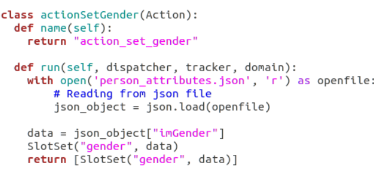
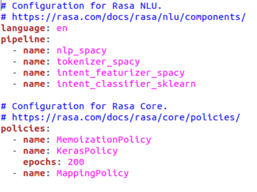

# ConversationalAgent RASA

## About Rasa
Rasa is an open-source Conversational AI framework for building AI assistants and chatbots. One of its unique features is that it's not tied to a prebuilt model or use-case. It can be customized according to our requirements.
Rasa has three main modules:
1. **Rasa NLU** for understanding user messages.
2. **Rasa Core** for holding conversations and deciding what to do next.
3. **Rasa Action Server** for triggering external actions like calling API's or making external changes.

## Explaining modules and features in the context of our Agent:
**Rasa NLU—** Here Rasa tries to understand User message to detect **Intent** and **Entity** in the message. The component used by NLU to detect intents in this project is Spacy and Tensorflow. We have created the following intents:
* start
* greet
* accept
* repeat
* reject
* goodbye
* chitchat
>The invocations for the intent are stored in the NLU.md file.

**Rasa Core—** Here Rasa helps with contextual message flow. Based on user message and intent classification by NLU it decides the response to be sent to the user. The responses are selected from the actions pre-written in the domain.yml file in the template section. The stories.md file contains the story templates. Rasa controls the flow of conversation between the user and chatbot according to theses templates, so for that flow, we need to train chatbot using these stories.

**Rasa Action Server—** This server handles the execution of actions defined in actions.py file. The actions.py file contains python code to execute if that action is invoked during a conversation of the chatbot with the user. Actions are used to fill **Slots** from external sources and for calling API's for example REST API.

***Slots* in Rasa—** Slots are your bot’s memory. They act as a key-value store that can be used to store information the user provided as well as information gathered about the outside world. The value of a slot can be used to direct the conversations and make them more personalized. Slots used in my chatbot are:

* **Situation -** The situation data is provided by Mission Agent to our RoboComp component conversationalAgent, which writes it to a JSON file from which the action *action_set_situation* reads it and sets the slot. This information is used to make the conversation personalized according to the use cases which will be explained in further blogs.


* **Gender -** The Gender data of User is read from AGM using our RoboComp conversationalAgent, which writes it to a JSON file from which the action *action_set_gender* reads it and sets the slot. The Gender of the user is used to make the conversation more personalized.


## Rasa file configurations for conversationalAgent

```__init__.py``` an empty file that helps python find your actions. As we will be using custom actions in this project we will have to create this file.

```data/nlu.md``` contains NLU training data. Here we define Intents Like greet or accept. We also add related Sentences or invocations for that Intent.

```data/stories.md``` contains stories. This is required for Rasa Core. There is something called “Dialog Flow in Rasa” where Rasa Core controls the flow of the conversation between user and chatbot, so for that flow, we need to train chatbot using these stories. Currently our stories.md file contains 120 stories.

```domain.yml``` contains assistant’s domain. This file combines Different Intent which chatbot can detect and list of Bot replies. It also contains the Slots and entities that will be set and used to direct the conversation and also actions both utterance and custom ones. We define our Custom Action Server Python method name here (in underscore format) so that Rasa will call that python method whenever required. *Example of custom action: action_set_situation*.

```config.yml``` contains the configuration of our NLU and Core models. As we will be using the Spacy pipeline we need to define it here. Pipeline used:


```credentials.yml``` contains details for connecting to other services. As we will be using REST API's we need to include its credentials in the file. We will also need to include the port details to host our Rasa Server on localhost.


```actions.py``` contains code for our custom actions. It contains python functions to read and write data to JSON file and set slots that will be used to direct the flow of our conversation.

## Execution

* The Rasa server and Action server are automatically started with the component conversationalAgent. 
* A Rasa Dialog has also been created to make it easy for users to train model, start an interactive session .etc All the features will be shared in further posts.
* You can also use shell commands to execute the chatbot. Link to Rasa docs: https://rasa.com/docs/rasa/user-guide/command-line-interface/

***
Rishi Gondkar